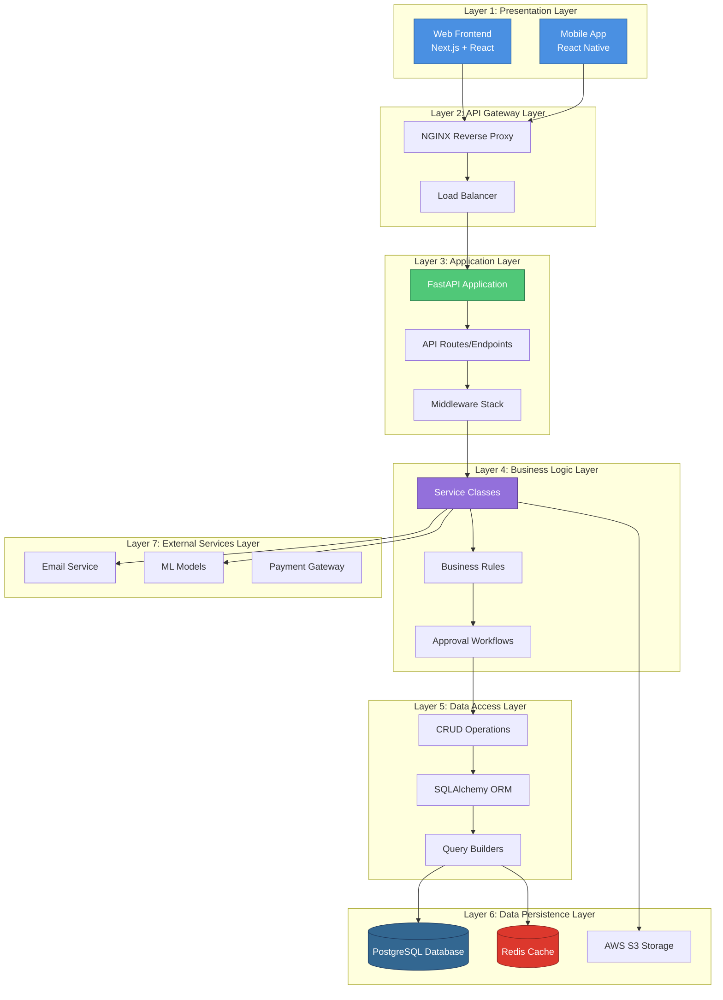
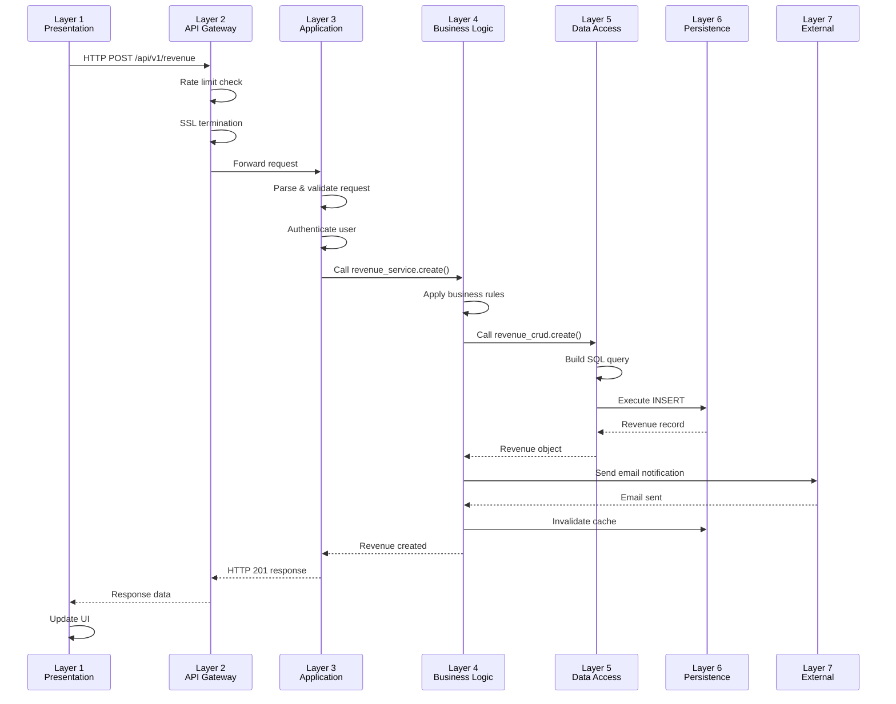

# Architectural Layers - Financial Management System

## Table of Contents
1. [Overview](#overview)
2. [Layer Architecture](#layer-architecture)
3. [Layer 1: Presentation Layer](#layer-1-presentation-layer)
4. [Layer 2: API Gateway Layer](#layer-2-api-gateway-layer)
5. [Layer 3: Application Layer](#layer-3-application-layer)
6. [Layer 4: Business Logic Layer](#layer-4-business-logic-layer)
7. [Layer 5: Data Access Layer](#layer-5-data-access-layer)
8. [Layer 6: Data Persistence Layer](#layer-6-data-persistence-layer)
9. [Layer 7: External Services Layer](#layer-7-external-services-layer)
10. [Cross-Cutting Concerns](#cross-cutting-concerns)
11. [Layer Communication](#layer-communication)
12. [Data Flow Example](#data-flow-example)

---

## Overview

The Financial Management System follows a **7-layer architectural pattern** based on the **N-Tier Architecture** and **Clean Architecture** principles. This separation ensures:

- **Modularity**: Each layer has a specific responsibility
- **Maintainability**: Changes in one layer don't affect others
- **Testability**: Layers can be tested independently
- **Scalability**: Layers can scale independently
- **Security**: Multiple security checkpoints across layers

---

## Layer Architecture



---

## Layer 1: Presentation Layer

**Purpose**: User interface and user experience

**Components**:
1. **Web Frontend** (Next.js 16 + React 19)
2. **Mobile Application** (React Native + Expo)

### Responsibilities

✅ **Rendering UI Components**
- Display data in user-friendly formats
- Forms, tables, charts, dashboards
- Responsive design for multiple devices

✅ **User Input Handling**
- Capture user actions (clicks, form submissions)
- Client-side validation
- Form state management

✅ **State Management**
- Local component state (React hooks)
- Global state (Zustand stores)
- Server state (TanStack Query cache)

✅ **User Experience**
- Loading states and spinners
- Error boundaries
- Toast notifications
- Theme management (dark/light mode)

### Technologies
```
Frontend:
- Next.js 16 (React framework with SSR/SSG)
- React 19 (UI library)
- TypeScript (type safety)
- styled-components (CSS-in-JS)
- TanStack Query (server state)
- Zustand (client state)
- React Hook Form (forms)
- Zod (validation)
- Recharts (visualizations)

Mobile:
- React Native (mobile framework)
- Expo (build tooling)
- Zustand (state management)
- TypeScript
```

### Example: Revenue Form Component
```typescript
// Layer 1: Presentation
export default function RevenueForm() {
  const { mutate: createRevenue } = useCreateRevenue();
  const { handleSubmit, register } = useForm<RevenueInput>();
  
  const onSubmit = (data: RevenueInput) => {
    createRevenue(data); // Calls API layer
  };
  
  return (
    <form onSubmit={handleSubmit(onSubmit)}>
      <Input {...register('amount')} />
      <Input {...register('description')} />
      <Button type="submit">Create Revenue</Button>
    </form>
  );
}
```

### Communication
- **Upstream**: Receives user input
- **Downstream**: Sends HTTP requests to API Gateway Layer (Layer 2)

---

## Layer 2: API Gateway Layer

**Purpose**: Entry point for all client requests, traffic management, and security

**Components**:
1. **NGINX Reverse Proxy**
2. **Load Balancer**
3. **SSL/TLS Termination**

### Responsibilities

✅ **Request Routing**
- Route requests to appropriate backend instances
- Path-based routing (`/api/v1/*` → Backend)
- Static file serving (`/_next/*` → Frontend assets)

✅ **Load Balancing**
- Distribute traffic across multiple backend instances
- Health checks on backend servers
- Fail-over to healthy instances

✅ **Security**
- SSL/TLS encryption (HTTPS)
- Rate limiting
- DDoS protection
- CORS policy enforcement

✅ **Compression & Caching**
- Gzip compression for responses
- Static asset caching headers
- CDN integration

### Configuration Example
```nginx
# NGINX Configuration
upstream backend {
    server backend1:8000 weight=3;
    server backend2:8000 weight=2;
    server backend3:8000 backup;
}

server {
    listen 443 ssl http2;
    
    # SSL Configuration
    ssl_certificate /path/to/cert.pem;
    ssl_certificate_key /path/to/key.pem;
    
    # Rate Limiting
    limit_req_zone $binary_remote_addr zone=api:10m rate=100r/s;
    
    location /api/ {
        limit_req zone=api burst=20;
        proxy_pass http://backend;
        proxy_set_header Host $host;
        proxy_set_header X-Real-IP $remote_addr;
    }
}
```

### Communication
- **Upstream**: Receives HTTP/HTTPS requests from Presentation Layer
- **Downstream**: Forwards requests to Application Layer (Layer 3)

---

## Layer 3: Application Layer

**Purpose**: HTTP request handling, routing, and middleware processing

**Components**:
1. **FastAPI Application** (`app/main.py`)
2. **API Routes** (`app/api/v1/*.py`)
3. **Middleware Stack**
4. **Dependency Injection**

### Responsibilities

✅ **Request Processing**
- Parse HTTP requests
- Extract headers, body, query parameters
- Request validation (Pydantic models)

✅ **Routing**
- Map URLs to endpoint handlers
- RESTful route organization
- API versioning (`/api/v1`, `/api/v2`)

✅ **Middleware Execution**
- CORS handling
- Logging and request ID generation
- Compression
- Error handling

✅ **Authentication & Authorization**
- JWT token validation
- User session management
- RBAC permission checks

✅ **Response Formatting**
- Serialize responses to JSON
- Set appropriate status codes
- Add response headers

### Structure
```
app/
├── main.py                 # FastAPI app initialization
├── api/
│   ├── deps.py            # Dependency injection
│   └── v1/
│       ├── auth.py        # Auth endpoints
│       ├── revenue.py     # Revenue endpoints
│       ├── expenses.py    # Expense endpoints
│       ├── budgets.py     # Budget endpoints
│       └── ...
└── core/
    ├── config.py          # Configuration
    ├── security.py        # Security utilities
    └── middleware.py      # Custom middleware
```

### Example: API Endpoint
```python
# Layer 3: Application
from fastapi import APIRouter, Depends, HTTPException
from app.api.deps import get_current_user, get_db

router = APIRouter()

@router.post("/revenue/", response_model=RevenueResponse)
async def create_revenue(
    revenue_in: RevenueCreate,  # Request validation
    db: Session = Depends(get_db),  # DI: Database session
    current_user: User = Depends(get_current_user)  # DI: Authenticated user
):
    # Delegate to business logic layer
    revenue = revenue_service.create_revenue(
        db=db,
        user=current_user,
        revenue_data=revenue_in
    )
    return revenue
```

### Communication
- **Upstream**: Receives routed requests from API Gateway Layer
- **Downstream**: Calls Business Logic Layer (Layer 4) services

---

## Layer 4: Business Logic Layer

**Purpose**: Core business rules, validation, and workflows

**Components**:
1. **Service Classes** (`app/services/*.py`)
2. **Business Validators**
3. **Workflow Engines** (Approval workflows)
4. **Domain Logic**

### Responsibilities

✅ **Business Rules Enforcement**
- Validate business constraints
- Calculate derived values
- Apply business formulas

✅ **Workflow Orchestration**
- Approval workflows (submit → approve → complete)
- Multi-step processes
- State transitions

✅ **Domain Logic**
- Budget variance calculations
- Forecast generation
- Profit/loss computations

✅ **Transaction Coordination**
- Coordinate multiple CRUD operations
- Ensure data consistency
- Rollback on errors

✅ **Event Handling**
- Trigger notifications
- Send background tasks
- Audit logging

### Structure
```
app/services/
├── revenue_service.py      # Revenue business logic
├── expense_service.py      # Expense business logic
├── budget_service.py       # Budget calculations
├── approval_service.py     # Approval workflows
├── forecast_service.py     # ML forecasting
├── notification_service.py # Notification logic
└── analytics_service.py    # Analytics calculations
```

### Example: Service Class
```python
# Layer 4: Business Logic
class RevenueService:
    def create_revenue(
        self,
        db: Session,
        user: User,
        revenue_data: RevenueCreate
    ) -> Revenue:
        # Business rule: Check user permissions
        if not self._can_create_revenue(user):
            raise PermissionError("User cannot create revenue")
        
        # Business rule: Validate amount
        if revenue_data.amount <= 0:
            raise ValueError("Amount must be positive")
        
        # Business logic: Create revenue
        revenue = revenue_crud.create(
            db=db,
            obj_in=revenue_data,
            user_id=user.id,
            status="pending"  # Default status
        )
        
        # Business workflow: Trigger approval
        self._initiate_approval_workflow(db, revenue)
        
        # Business event: Send notification
        notification_service.create_notification(
            db=db,
            user_id=revenue.finance_admin_id,
            message=f"New revenue entry requires approval",
            type="approval_required"
        )
        
        # Business event: Invalidate cache
        cache_service.invalidate_dashboard_cache(user.id)
        
        return revenue
    
    def _can_create_revenue(self, user: User) -> bool:
        return user.role in ["admin", "finance_manager", "accountant", "employee"]
    
    def _initiate_approval_workflow(self, db: Session, revenue: Revenue):
        approval_service.create_approval(
            db=db,
            resource_id=revenue.id,
            resource_type="revenue",
            approver_id=revenue.user.finance_admin_id
        )
```

### Communication
- **Upstream**: Called by Application Layer endpoints
- **Downstream**: Calls Data Access Layer (Layer 5) for persistence

---

## Layer 5: Data Access Layer

**Purpose**: Database operations abstraction and query building

**Components**:
1. **CRUD Classes** (`app/crud/*.py`)
2. **SQLAlchemy ORM**
3. **Query Builders**
4. **Repository Pattern**

### Responsibilities

✅ **CRUD Operations**
- Create, Read, Update, Delete operations
- Generic base CRUD class
- Type-safe database operations

✅ **Query Building**
- Complex query construction
- Joins and relationships
- Filtering and pagination

✅ **Data Mapping**
- ORM model ↔ Pydantic schema conversion
- Database row ↔ Python object mapping

✅ **Database Abstraction**
- Hide SQL details from business logic
- Database-agnostic operations
- Easy database switching

### Structure
```
app/crud/
├── base.py              # Generic CRUD base class
├── crud_user.py         # User CRUD operations
├── crud_revenue.py      # Revenue CRUD operations
├── crud_expense.py      # Expense CRUD operations
├── crud_budget.py       # Budget CRUD operations
└── ...
```

### Example: CRUD Class
```python
# Layer 5: Data Access
from app.crud.base import CRUDBase
from app.models.revenue import Revenue
from app.schemas.revenue import RevenueCreate, RevenueUpdate

class CRUDRevenue(CRUDBase[Revenue, RevenueCreate, RevenueUpdate]):
    def get_by_user(
        self,
        db: Session,
        user_id: UUID,
        skip: int = 0,
        limit: int = 100
    ) -> List[Revenue]:
        return (
            db.query(Revenue)
            .filter(Revenue.user_id == user_id)
            .offset(skip)
            .limit(limit)
            .all()
        )
    
    def create(
        self,
        db: Session,
        obj_in: RevenueCreate,
        user_id: UUID,
        status: str = "pending"
    ) -> Revenue:
        db_obj = Revenue(
            **obj_in.dict(),
            user_id=user_id,
            status=status,
            created_at=datetime.utcnow()
        )
        db.add(db_obj)
        db.commit()
        db.refresh(db_obj)
        return db_obj
    
    def get_approved_by_date_range(
        self,
        db: Session,
        start_date: date,
        end_date: date
    ) -> List[Revenue]:
        return (
            db.query(Revenue)
            .filter(Revenue.status == "approved")
            .filter(Revenue.created_at >= start_date)
            .filter(Revenue.created_at <= end_date)
            .all()
        )

revenue_crud = CRUDRevenue(Revenue)
```

### ORM Models
```python
# SQLAlchemy Model
class Revenue(Base):
    __tablename__ = "revenue"
    
    id = Column(UUID(as_uuid=True), primary_key=True, default=uuid4)
    user_id = Column(UUID(as_uuid=True), ForeignKey("users.id"))
    amount = Column(Numeric(precision=15, scale=2), nullable=False)
    description = Column(String(500), nullable=False)
    category = Column(String(100), nullable=False)
    status = Column(String(50), default="pending")
    created_at = Column(DateTime, default=datetime.utcnow)
    
    # Relationships
    user = relationship("User", back_populates="revenues")
    project = relationship("Project", back_populates="revenues")
```

### Communication
- **Upstream**: Called by Business Logic Layer services
- **Downstream**: Executes queries on Data Persistence Layer (Layer 6)

---

## Layer 6: Data Persistence Layer

**Purpose**: Physical data storage and retrieval

**Components**:
1. **PostgreSQL Database** (Primary data store)
2. **Redis Cache** (Session and cache storage)
3. **AWS S3** (File storage)

### 6.1 PostgreSQL Database

**Responsibilities**:
- Store structured relational data
- Ensure ACID compliance
- Handle complex queries and joins
- Maintain referential integrity

**Tables**:
```sql
-- Core tables
users
revenue
expenses
budgets
budget_items
scenarios
forecasts
projects
departments
inventory
sales
approvals
notifications
audit_logs
```

**Features**:
- Foreign key constraints
- Indexes for performance
- Triggers for audit logging
- Views for complex queries

### 6.2 Redis Cache

**Responsibilities**:
- Cache frequently accessed data
- Store user sessions
- Manage JWT token blacklist
- Queue background tasks (Celery broker)
- Rate limiting counters

**Data Structures**:
```redis
# Session storage
session:{user_id} → JSON user data (TTL: 24h)

# Cache keys
dashboard:{user_id} → JSON dashboard data (TTL: 5m)
budget:{id} → JSON budget data (TTL: 10m)

# Rate limiting
ratelimit:{user_id}:{endpoint} → Counter (TTL: 1h)

# Task queue
celery:tasks → List of pending tasks
```

### 6.3 AWS S3 Storage

**Responsibilities**:
- Store file uploads (receipts, invoices)
- Store generated reports (PDF, Excel)
- Store ML model files
- Store backups

**Bucket Structure**:
```
s3://finance-app-bucket/
├── receipts/
│   └── {user_id}/{expense_id}.pdf
├── reports/
│   └── {report_id}.pdf
├── models/
│   └── {model_name}_{version}.joblib
└── backups/
    └── {date}/database.sql
```

### Communication
- **Upstream**: Receives queries from Data Access Layer
- **Downstream**: Physical disk storage, network storage

---

## Layer 7: External Services Layer

**Purpose**: Integration with third-party services and external systems

**Components**:
1. **Email Service** (SMTP)
2. **Machine Learning Models**
3. **Payment Gateway** (Optional)
4. **Analytics Service** (Optional)

### 7.1 Email Service (SMTP)

**Purpose**: Send transactional and notification emails

**Use Cases**:
- Welcome emails
- Password reset emails
- Approval notifications
- Daily/weekly reports
- Alert emails

**Implementation**:
```python
# Email service integration
class EmailService:
    def __init__(self):
        self.smtp_host = settings.SMTP_HOST
        self.smtp_port = settings.SMTP_PORT
    
    async def send_email(
        self,
        to: str,
        subject: str,
        body: str,
        template: str = None
    ):
        # Send via SMTP
        ...
```

### 7.2 Machine Learning Models

**Purpose**: Forecasting and predictive analytics

**Models**:
- **ARIMA/SARIMA**: Time series forecasting
- **Prophet**: Seasonal forecasting
- **LSTM**: Deep learning forecasts
- **XGBoost**: Gradient boosting predictions

**Integration**:
```python
# ML service integration
class ForecastService:
    def generate_forecast(
        self,
        historical_data: DataFrame,
        periods: int,
        model_type: str = "prophet"
    ) -> Forecast:
        # Load trained model
        model = joblib.load(f"models/{model_type}.joblib")
        
        # Generate predictions
        predictions = model.predict(periods)
        
        return predictions
```

### 7.3 Payment Gateway (Optional)

**Purpose**: Process payments for paid features

**Integration**: Stripe, PayPal, etc.

### Communication
- **Upstream**: Called by Business Logic Layer or Background Tasks
- **Downstream**: External API endpoints, ML models on disk

---

## Cross-Cutting Concerns

These concerns span across all layers:

### 1. **Security**
- **Layer 1**: Input validation, XSS prevention
- **Layer 2**: SSL/TLS, rate limiting
- **Layer 3**: Authentication, authorization
- **Layer 4**: Business rule enforcement
- **Layer 5**: SQL injection prevention
- **Layer 6**: Encryption at rest
- **Layer 7**: API key management

### 2. **Logging**
```python
# Structured logging across all layers
logger.info(
    "Revenue created",
    extra={
        "layer": "business_logic",
        "user_id": user.id,
        "revenue_id": revenue.id,
        "amount": revenue.amount
    }
)
```

### 3. **Error Handling**
```python
# Centralized error handling
try:
    # Business logic
    revenue = revenue_service.create_revenue(...)
except ValidationError as e:
    # Layer 4 error
    raise HTTPException(status_code=400, detail=str(e))
except PermissionError as e:
    # Layer 4 error
    raise HTTPException(status_code=403, detail=str(e))
except Exception as e:
    # Unexpected error
    logger.error("Unexpected error", exc_info=True)
    raise HTTPException(status_code=500, detail="Internal server error")
```

### 4. **Monitoring**
- Request/response metrics at Layer 2-3
- Business metrics at Layer 4
- Query performance at Layer 5
- Database metrics at Layer 6

### 5. **Caching**
- Page/component caching at Layer 1
- API response caching at Layer 3
- Query result caching at Layer 5
- Data caching at Layer 6 (Redis)

---

## Layer Communication

### Communication Flow



### Dependency Rules

**Dependencies flow inward** (Clean Architecture principle):
```
Layer 1 → Layer 2 → Layer 3 → Layer 4 → Layer 5 → Layer 6
                                    ↓
                                Layer 7
```

**Rules**:
- Outer layers **depend on** inner layers
- Inner layers **never depend on** outer layers
- Business logic (Layer 4) knows nothing about HTTP, UI, or databases
- Data Access (Layer 5) knows only about data structures, not business rules

---

## Data Flow Example

### Creating a Revenue Entry - Complete Flow

**1. User Action (Layer 1)**
```typescript
// User fills form and clicks submit
const onSubmit = (data: RevenueInput) => {
  createRevenueMutation.mutate(data);
};
```

**2. HTTP Request (Layer 1 → Layer 2)**
```http
POST /api/v1/revenue HTTP/1.1
Host: api.example.com
Authorization: Bearer eyJhbGc...
Content-Type: application/json

{
  "amount": 5000.00,
  "description": "Q1 Sales",
  "category": "sales",
  "project_id": "123e4567-..."
}
```

**3. Gateway Processing (Layer 2)**
- Check rate limit: ✓ 45/100 requests this hour
- SSL termination: ✓
- Route to backend instance: backend-2

**4. Application Handling (Layer 3)**
```python
@router.post("/revenue/")
async def create_revenue(
    revenue_in: RevenueCreate,  # Validated
    current_user: User = Depends(get_current_user)  # Authenticated
):
    # Delegate to service layer
    revenue = revenue_service.create_revenue(...)
    return revenue
```

**5. Business Logic (Layer 4)**
```python
def create_revenue(db, user, revenue_data):
    # Business rule: Check permission
    if user.role not in ALLOWED_ROLES:
        raise PermissionError()
    
    # Business rule: Validate amount
    if revenue_data.amount <= 0:
        raise ValueError("Amount must be positive")
    
    # Create revenue (call Layer 5)
    revenue = revenue_crud.create(db, revenue_data, user.id)
    
    # Business workflow: Initiate approval
    approval_service.create_approval(db, revenue)
    
    # Business event: Notify approver
    notification_service.notify_approval_required(db, revenue)
    
    # Business event: Clear cache
    cache.delete(f"dashboard:{user.id}")
    
    return revenue
```

**6. Data Access (Layer 5)**
```python
def create(db, obj_in, user_id):
    db_obj = Revenue(
        amount=obj_in.amount,
        description=obj_in.description,
        category=obj_in.category,
        user_id=user_id,
        status="pending"
    )
    db.add(db_obj)
    db.commit()
    db.refresh(db_obj)
    return db_obj
```

**7. Database Operation (Layer 6)**
```sql
INSERT INTO revenue (id, user_id, amount, description, category, status, created_at)
VALUES (
    'abc123...',
    'user123...',
    5000.00,
    'Q1 Sales',
    'sales',
    'pending',
    '2026-01-21 11:20:00'
);
```

**8. External Service (Layer 7)**
```python
# Send email notification
email_service.send_email(
    to=approver.email,
    subject="New Revenue Entry Requires Approval",
    template="approval_required",
    data={"revenue": revenue}
)
```

**9. Response Flow (Layer 6 → Layer 1)**
```
Layer 6: Revenue record returned
Layer 5: Revenue object returned
Layer 4: Revenue with approvals returned
Layer 3: Serialize to JSON
Layer 2: Add compression, logging
Layer 1: Update UI with new revenue
```

---

## Summary

### Total Layers: **7 Architectural Layers**

| Layer | Name | Purpose | Technologies |
|-------|------|---------|--------------|
| **1** | Presentation | UI/UX | Next.js, React Native |
| **2** | API Gateway | Traffic mgmt | NGINX, Load Balancer |
| **3** | Application | Request handling | FastAPI, Routes |
| **4** | Business Logic | Domain rules | Service classes |
| **5** | Data Access | DB abstraction | CRUD, SQLAlchemy |
| **6** | Data Persistence | Storage | PostgreSQL, Redis, S3 |
| **7** | External Services | 3rd party integrations | SMTP, ML, APIs |

### Key Benefits

✅ **Separation of Concerns**: Each layer has a single, well-defined responsibility

✅ **Modularity**: Layers can be developed, tested, and deployed independently

✅ **Testability**: Each layer can be unit tested in isolation

✅ **Scalability**: Layers can scale independently based on load

✅ **Maintainability**: Changes in one layer don't cascade to others

✅ **Security**: Multiple security checkpoints across layers

✅ **Flexibility**: Easy to swap implementations (e.g., PostgreSQL → MySQL)

✅ **Reusability**: Business logic can be shared across multiple interfaces

---

*This layered architecture ensures the Financial Management System is robust, maintainable, and scalable for enterprise use.*